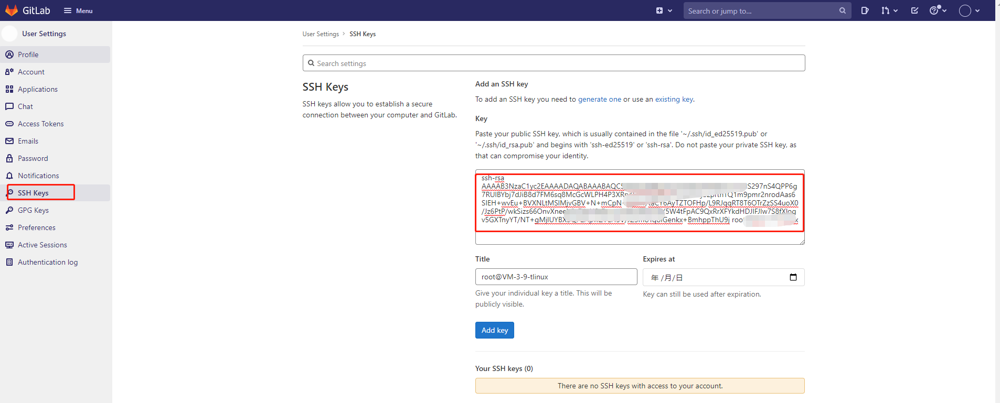

# <center>GitLab的安装及使用

## **安装**

1、配置yum源

```
vim /etc/yum.repos.d/gitlab-ce.repo
复制以下内容：
[root@chen ~]# cat  /etc/yum.repos.d/gitlab-ce.repo
[gitlab-ce]  
name=gitlab-ce   
baseurl=http://mirrors.tuna.tsinghua.edu.cn/gitlab-ce/yum/el7  
repo_gpgcheck=0  
gpgcheck=0  
enabled=1  
gpgkey=https://packages.gitlab.com/gpg.key 
```

 2、更新本地yum缓存   sudo yum makecache

```
[root@chen ~]# yum makecache
yum install -y postfix
systemctl enable postfix
vim /etc/postfix/main.cf #删除 inet_interfaces = all 前的 #，在 inet_interfaces = localhost 前加上
systemctl start postfix
```

 3、安装GitLab社区版

sudo yum install gitlab-ce #自动安装最新版 

```
[root@chen ~]# sudo EXTERNAL_URL="实例公网 IP 地址" yum install -y gitlab-ce
```

4，安装完 需要修改下配置文件，将指的域名替换成公网IP

```
vim /etc/gitlab/gitlab.rb
#将external_url 变量的地址修改为gitlab所在centos的ip地址。
external_url ‘http://git.home.com’
gitlab-ctl reconfigure          //让配置生效，重新执行此命令时间也比较长
gitlab-ctl restart
```


5，获得用户数据，修改用户密码

```
[root@VM-3-9-tlinux /opt/gitlab/bin]# gitlab-rails console
irb(main):007:0> User.where(id: 1).first
=> #<User id:1 @root>
irb(main):008:0> user = User.where(id: 1).first
=> #<User id:1 @root>
irb(main):009:0> user.password=12345678
=> 12345678
irb(main):010:0> user.password_confirmation=12345678
=> 12345678
irb(main):011:0> user.save!
Enqueued ActionMailer::MailDeliveryJob (Job ID: 4977da90-a2bf-4687-b39b-bb65430f8530) to Sidekiq(mailers) with arguments: "DeviseMailer", "password_change", "deliver_now", {:args=>[#<GlobalID:0x00007f1528ab9930 @uri=#<URI::GID gid://gitlab/User/1>>]}
=> true
irb(main):012:0> quit
```


## GitLab常用命令

```
udo gitlab-ctl start          # 启动所有 gitlab 组件；
sudo gitlab-ctl stop           # 停止所有 gitlab 组件；
sudo gitlab-ctl restart        # 重启所有 gitlab 组件；
sudo gitlab-ctl status          # 查看服务状态；
sudo gitlab-ctl reconfigure      # 启动服务；
sudo vim /etc/gitlab/gitlab.rb     # 修改默认的配置文件；
gitlab-rake gitlab:check SANITIZE=true --trace    # 检查gitlab；
sudo gitlab-ctl tail              # 查看日志；
```

## GitLab使用

 登录GitLab
1、在浏览器的地址栏中输入公网IP即可登录GitLab的界面，使用上面修改的的用户名和密码为 root 和 xxxxxxx

 

2、首次登录会强制用户修改密码。密码修改成功后，输入新密码进行登录。 

## 创建Project

 1，安装Git工具linux：安装Git，使用自带的源安装。或者Windows 安装git

```
[root@VM-3-9-tlinux ~]# yum install git   
```

 2，生成密钥文件：使用ssh-keygen生成密钥文件.ssh/id_rsa.pub。 

```
[root@VM-3-9-tlinux ~]# ssh-keygen 
Generating public/private rsa key pair.
Enter file in which to save the key (/root/.ssh/id_rsa): 
Enter passphrase (empty for no passphrase): 
Enter same passphrase again: 
Your identification has been saved in /root/.ssh/id_rsa.
Your public key has been saved in /root/.ssh/id_rsa.pub.
The key fingerprint is:
SHA256:8O/MfCKmOcz6SfDk8adEhgXfFQbXH44Rn4meKZs8i8Y root@VM-3-9-tlinux
The key's randomart image is:
+---[RSA 2048]----+
|      .   ..=+.  |
|       o . + .+.o|
|      . o .  .+=.|
|       =    ..o..|
|    . + S  . +   |
|     = = .. +    |
|     o+ + o=     |
|     .++oEo +    |
|    .o=+oo=+     |
+----[SHA256]-----+
```

 3，在GitLab的主页中新建一个Project 


 4，添加ssh key导入步骤2中生成的密钥文件内容： 



5， ssh key添加完成：  可以通过命令验证 ssh -T git@github.com 

 6，项目地址，该地址在进行clone操作时需要用到:  

## 克隆项目

1. 在已纳入管理的 PC 上执行以下命令，配置使用 Git 仓库的人员姓名。

   ```
   git config --global user.name "username" 
   ```

2. 执行以下命令，配置使用 Git 仓库的人员邮箱。

   ```
   git config --global user.email "xxx@example.com" 
   ```

3. 执行以下命令，克隆项目。其中“项目地址”请替换为项目地址。

   ```
   git clone “项目地址”
   ```

   克隆项目成功后，会在本地生成同名目录且包含项目中所有文件。

## 初始化本地项目

```
PS F:\容器wiki> git init
Reinitialized existing Git repository in F:/容器wiki/.git/
PS F:\容器wiki> git remote add origin  git@1.116.17.152:root/kubernetes.git
PS F:\容器wiki> git  add . 
PS F:\容器wiki> git commit -m "first"
PS F:\容器wiki> git push  -u origin master
```

## 上传文件

1. 执行以下命令，进入项目目录。

   ```
   cd test/
   ```

2. 执行以下命令，创建需上传至 GitLab 的目标文件。本文以 test.sh 为例。

   ```
   echo "test" > test.sh
   ```

3. 执行以下命令，将 test.sh 文件加入索引中。

   ```
   git add test.sh
   ```

4. 执行以下命令，将 test.sh 提交至本地仓库。

   ```
   git commit -m "test.sh"
   ```

5. 执行以下命令，将 test.sh 同步至 GitLab 服务器。

   ```
   git push -u origin master
   
   ```


