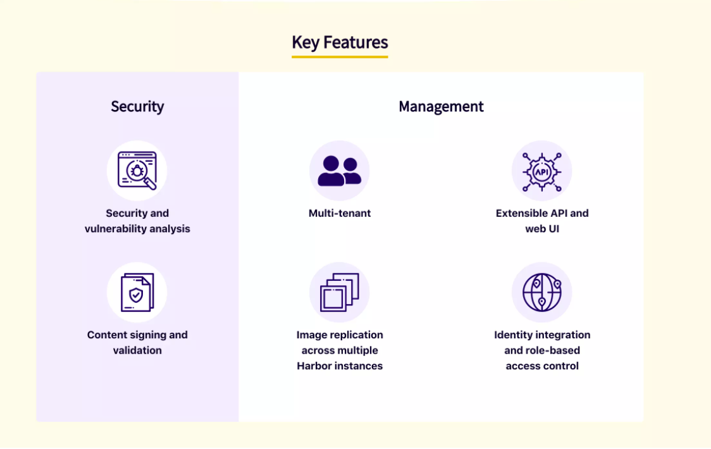
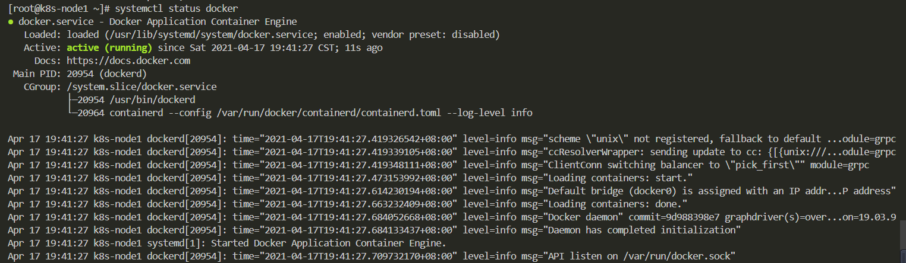
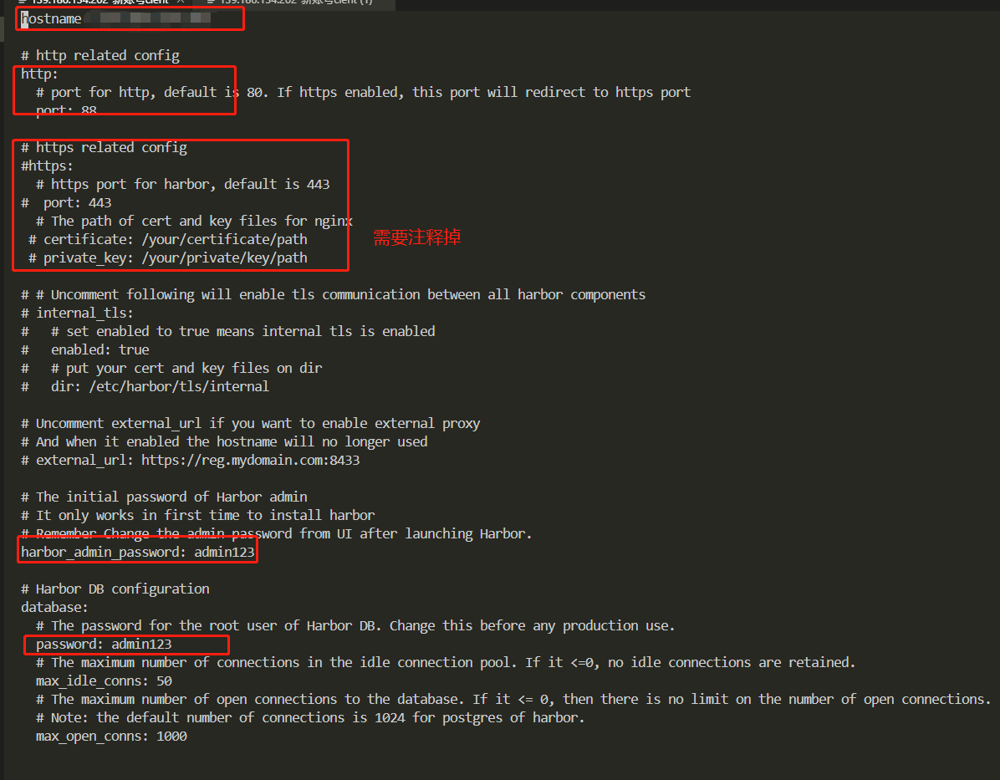
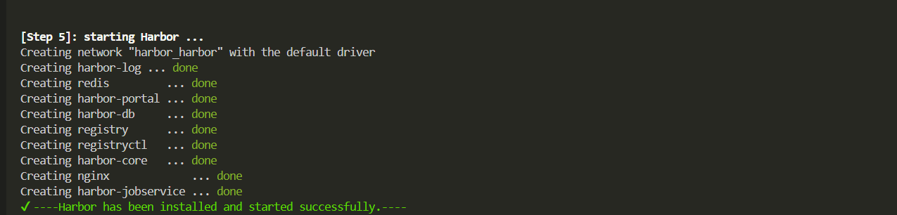
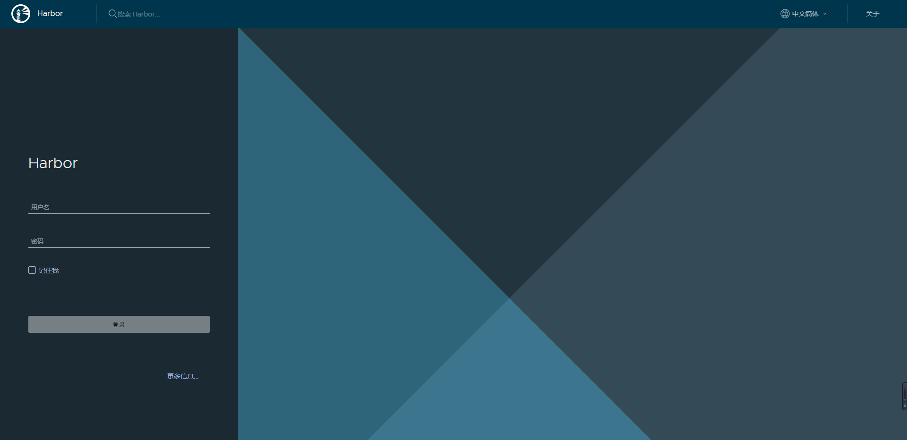
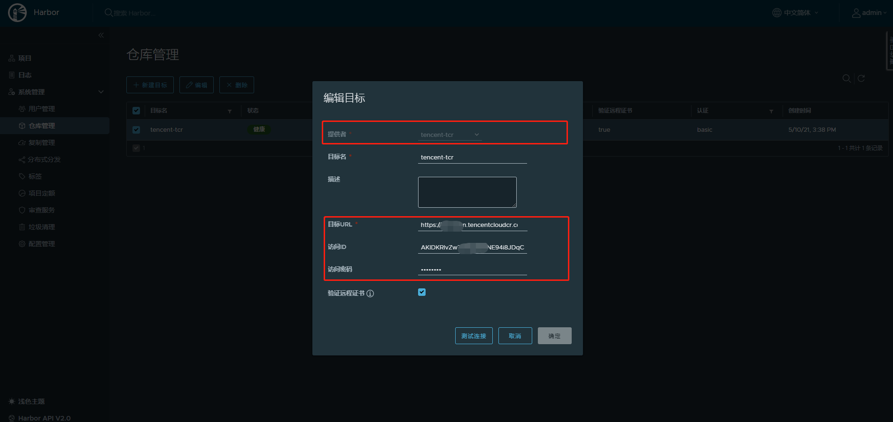
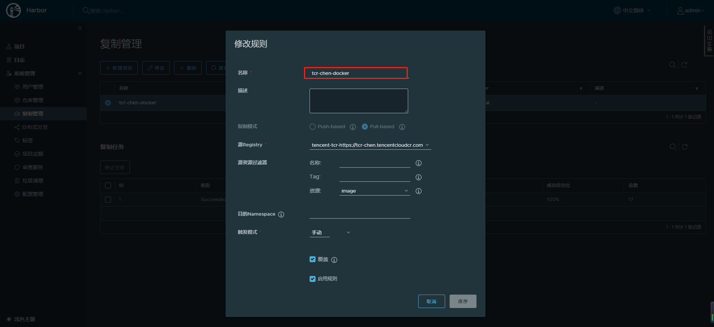
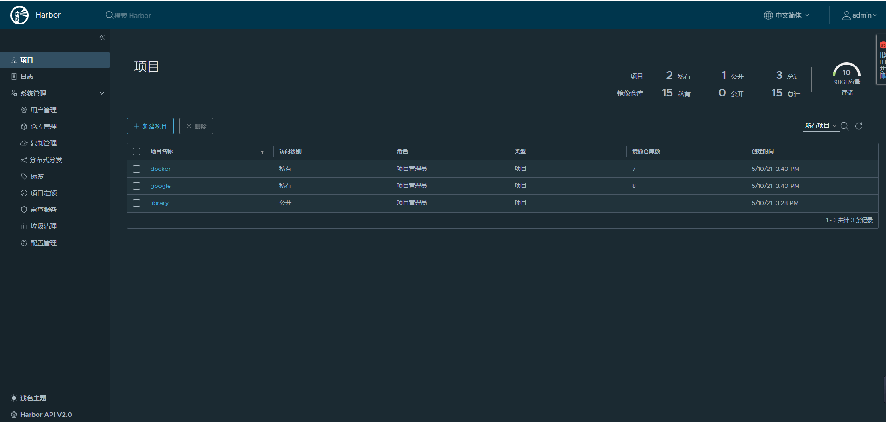
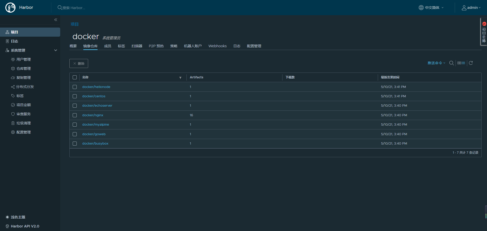

## 一  什么是Harbor

Harbor 是由 VMware 公司中国团队为企业用户设计的 Registry server 开源项目，包括了权限管理(RBAC)、LDAP、审计、管理界面、自我注册、HA 等企业必需的功能，同时针对中国用户的特点，设计镜像复制和中文支持等功能

官方文档：https://github.com/goharbor/harbor

部署参考文档：https://my.oschina.net/u/2277632/blog/3095815



## 二  部署安装

1. CentOS Linux release 7.8.2003 (Core)
2. Docker version 19.03.13
3. docker-compose version 1.24.1

### 1 docker安装

下载地址：https://download.docker.com/linux/static/stable/x86_64/docker-19.03.9.tgz

二进制安装，所有节点操作

#### 1.1，下载并解压二进制包

```
wget https://download.docker.com/linux/static/stable/x86_64/docker-19.03.9.tgz
tar zxvf docker-19.03.9.tgz
mv docker/* /usr/bin
```

#### 1.2，systemd管理docker

```
cat > /usr/lib/systemd/system/docker.service << EOF
[Unit]
Description=Docker Application Container Engine
Documentation=https://docs.docker.com
After=network-online.target firewalld.service
Wants=network-online.target

[Service]
Type=notify
ExecStart=/usr/bin/dockerd
ExecReload=/bin/kill -s HUP $MAINPID
LimitNOFILE=infinity
LimitNPROC=infinity
LimitCORE=infinity
TimeoutStartSec=0
Delegate=yes
KillMode=process
Restart=on-failure
StartLimitBurst=3
StartLimitInterval=60s

[Install]
WantedBy=multi-user.target
EOF

```

#### 1.3，创建配置文件

```
mkdir /etc/docker
cat > /etc/docker/daemon.json << EOF
{
  "registry-mirrors": ["https://mirror.ccs.tencentyun.com"]
}
EOF
#阿里云镜像加速器 也可以替换成腾讯云的镜像加速

```

#### 1.4，启动并设置开机启动

```
systemctl daemon-reload
systemctl start docker
systemctl enable docker
systemctl status docker

```




### 2 docker-compose安装

官网文档介绍：https://docs.docker.com/compose/install/

#### 2.1，下载安装包

或者离线下载安装包我们可以从 Github 上下载它的二进制包来使用，最新发行的版本地址：https://github.com/docker/compose/releases

或通过命令行下载

```
sudo curl -L "https://github.com/docker/compose/releases/download/1.24.1/docker-compose-(uname -s)−(uname -m)" -o /usr/local/bin/docker-compose
```

#### 2.2，安装docker-compose

```
sudo chmod +x  /usr/local/bin/docker-compose
sudo ln -s /usr/local/bin/docker-compose /usr/bin/docker-compose
```


### 3 安装Harbor

```
 wget https://github.com/goharbor/harbor/releases/download/v2.1.4/harbor-offline-installer-v2.1.4.tgz

  tar xvf harbor-offline-installer-v2.1.4.tgz
```

根据需要修改相关参数

```
[root@chen harbor]# cp harbor.yml.tmpl harbor.yml  #默认是harbor.yml.tmpl需要将这个文件重命名一下
[root@chen harbor]# vi harbor.yml
[root@chen harbor]# ./install.sh 
```

  



有如上提示表示安装成功

## 三  基本使用

 然后我们访问一下这个地址，账号是admin123，密码就是配置文件里面那个harbor.yml文件里面



### 1 仓库管理

可以添加其他仓管，以腾讯云TCR镜像仓库为例



### 2  复制管理

复制管理 可以将本地镜像复制到其他镜像仓库，也可以将其他镜像仓库复制到本地



### 3 项目管理



### 4 仓库管理



### 