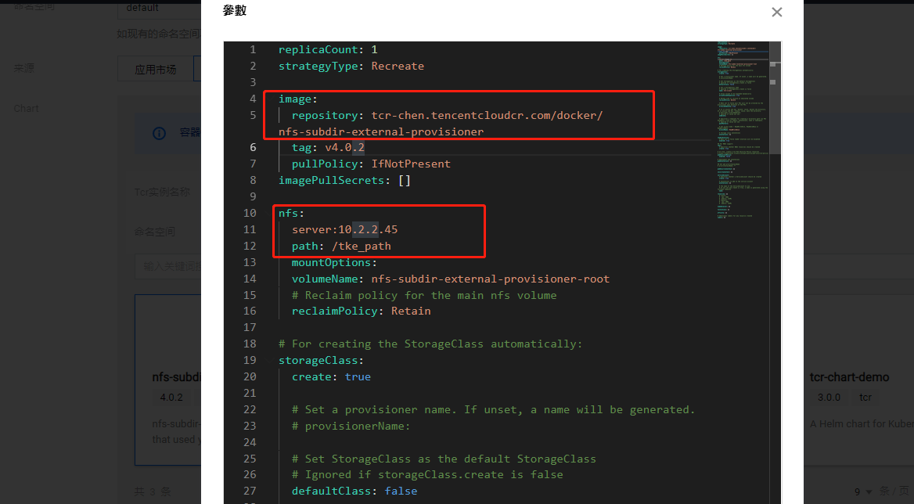
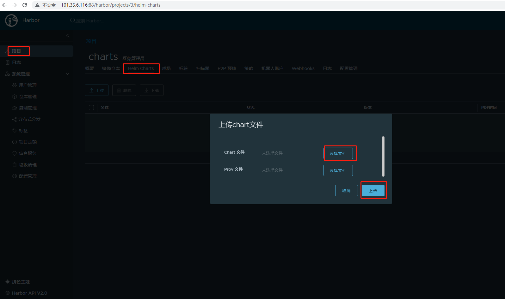

### 一 安装 Helm 客户端

Helm项目提供了两种获取和安装Helm的方式。这是官方提供的获取Helm发布版本的方法。另外， Helm社区提供了通过不同包管理器安装Helm的方法。这些方法可以在下面的官方方法之后看到。

**用二进制版本安装**

每个Helm [版本](https://github.com/helm/helm/releases)都提供了各种操作系统的二进制版本，这些版本可以手动下载和安装。

1. 下载 [需要的版本](https://github.com/helm/helm/releases)
2. 解压(`tar -zxvf helm-v3.0.0-linux-amd64.tar.gz`)
3. 在解压目中找到`helm`程序，移动到需要的目录中(`mv linux-amd64/helm /usr/local/bin/helm`)

具体可以参考： https://helm.sh/zh/docs/intro/install/

### 二 添加helm仓库

以腾讯云TCR镜像仓库为例

```
helm repo add $instance-$namespace https://$instance.tencentcloudcr.com/chartrepo/$namespace --username $username --password $instance-token

#helm repo add  tke-pass-helm   https://tke-pass.tencentcloudcr.com/chartrepo/helm --username 10002438xxxx   --password  密码xxxxxxxx
```

- `$instance-$namespace`：为 helm repo 名称，建议使用**实例名称+命名空间名称**组合的方式命名，以便于区分各个实例及命名空间。

- ```
  https://$instance.tencentcloudcr.com/chartrepo/$namespace
  ```

  ：为 helm repo 的远端地址。

  - `$username`：已获取的用户名。
  - `$instance-token`：已获取的登录密码。
    如添加成功将提示以下信息。

```
"tcr-chen-helm" has been added to your repositories
```

使用该命令可以查看当前的helm 仓库信息

```
# helm repo list
NAME                            URL                                                                                           
nfs-subdir-external-provisioner https://kubernetes-sigs.github.io/nfs-subdir-external-provisioner/
tcr-chen-helm                   https://tcr-chen.tencentcloudcr.com/chartrepo/helm
```

### 三 推送 Helm Chart

1. 安装 Helm Push 插件

   > 注意：
   >
   > 请安装 0.9.0 及以上版本的 helm-push 插件，避免因版本不兼容等问题造成无法正常推送 helm chart。

   使用 Helm CLI 上传 Chart 包需要安装 helm-push 插件，该插件支持使用helm push 指令推送 helm chart 至指定 repo，同时支持上传目录及压缩包。

   ```
   helm plugin install https://github.com/chartmuseum/helm-push
   ```

2. 在节点上执行以下命令，创建一个 Chart。

   ```
   helm create tcr-chart-demo
   ```

3. 执行以下命令，可直接推送指定目录至 Chart 仓库（可选）。

   ```
   helm push tcr-chart-demo $instance-$namespace
   #helm cm-push tcr-chart-demo $instance-$namespace  #高级版本使用的是cm-push命令
   ```

   其中   $instance-$namespace  为已添加的本地仓库名称。

4. 执行以下命令，可压缩指定目录，并推送至 Chart 仓库。

   ```shell
   tar zcvf tcr-chart-demo-1.0.0.tgz tcr-chart-demo/
   ```

   ```
   helm push tcr-chart-demo-1.0.0.tgz $instance-$namespace
   ```

   其中$instance-$namespace为已添加的本地仓库名称。

### 四 拉取 Helm Chart

1. 在节点上执行以下命令，获取最新的 Chart 信息。

   ```
   helm repo update
   ```

2. 执行以下命令，拉取指定版本 Helm Chart。

   ```
   helm fetch <本地仓库名称>/<Chart 名称> --version <Chart 版本>
   ```

   以从企业版实例 tcr-demo 中拉取命名空间 project-a 内 tcr-chart-demo 1.0.0 版本为例：

   ```
   helm fetch tcr-chen-heml/tcr-chart-demo --version 1.0.0
   ```



### 五 Harbor 启用 helmchart 服务

#### 1，安装 harbor 的 helmchart repository

默认新版 harbor 不会启用 chart repository service，如果需要管理 helm，我们需要在安装时添加额外的参数，例如：启用 chart repository service 服务的安装方式要添加一个参数 --with-chartmuseum

```
[root@VM-55-9-tlinux ~/docker-compose/harbor]# ./install.sh --with-chartmuseum
```

安装完成后，会有这个提示 说明是安装成功：

```
⠿ Container chartmuseum              Started 
```

#### 2，发布 helm charts

**方式一、基于dashboard 的可视化上传**

使用浏览器登录 harbor 后，在对应的管理界面操作即可，如下图：



**方式二、基于命令行的 CLI 推送**

更多时候基于第1种UI界面的上传并不能满足我们的实际需求，大部分情况我们都是要通过脚本发布helmchart 的。

1、安装插件

为了能使用命令推送，我们需要安装并使用 helm push 插件包，地址： https://github.com/chartmuseum/helm-push/releases

a) 在线安装插件：

```
helm plugin install https://github.com/chartmuseum/helm-pus
```

b) 离线安装插件：

下载安装包 helm-push_0.10.1_linux_amd64.tar.gz，再使用命令 helm env 获取 HELM_PLUGINS 路径，然后放置和解压安装包，最后使用 helm plugin list 查看结果，如下：

```
[root@VM-55-9-tlinux ~/harbor]# helm env | grep HELM_PLUGINS
HELM_PLUGINS="/root/.local/share/helm/plugins
[root@VM-55-9-tlinux ~/harbor]# mkdir -p /root/.local/share/helm/plugins/helm-push
[root@VM-55-9-tlinux ~/harbor]# mv helm-push_0.10.1_linux_amd64.tar.gz /root/.local/share/helm/plugins/helm-push/
[root@VM-55-9-tlinux ~/harbor]# cd /root/.local/share/helm/plugins/helm-push/
[root@VM-55-9-tlinux helm-push]# tar -xzvf helm-push_0.10.1_linux_amd64.tar.gz 
[root@VM-55-9-tlinux helm-push]# helm plugin list
NAME    VERSION DESCRIPTION                    
cm-push 0.10.1  Push chart package to ChartMuseum

```

2、添加 harbor 仓库到本地 helm 仓库列表

查看本地仓库列表(列出的是我已经添加其他仓库)

```
[root@VM-55-9-tlinux ~/helm]# helm repo list
NAME            URL                                             
tke-pass-helm   https://tke-pass.tencentcloudcr.com/chartrepo/helm

# 添加仓库地址到本地列表(其中 myharbor-helm 为这个仓库地址在 helm 本地的名称，连接是仓库URL，后面是登录 harbor 的用户名和密码)
# URL格式：http(s)://{harbor域名或iP:端口(如果默认443或80可不加)}/chartrepo/{yourHarborProjectName}

[root@VM-55-9-tlinux ~/helm]# helm repo add myharbor-helm http://101.35.6.116:88/chartrepo/charts --username admin  --password admin123
"myharbor-helm" has been added to your repositories

 # 再查看(发现已添加成功)
 [root@VM-55-9-tlinux ~/helm]# helm repo list
NAME            URL                                             
tke-pass-helm   https://tke-pass.tencentcloudcr.com/chartrepo/helm
myharbor-helm   http://101.35.6.116:88/chartrepo/charts

##更新本地仓库缓存内容
[root@VM-55-9-tlinux ~/helm]# helm repo update
Hang tight while we grab the latest from your chart repositories...
...Successfully got an update from the "myharbor-helm" chart repository
...Successfully got an update from the "tke-pass-helm" chart repository
Update Complete. ⎈Happy Helming!⎈

```

> 注意点
>
> 1.harbor 仓库 URL 中的 chartrepo 是固定值。
>
> 2.在操作之前，请务必先在 harbor 中创建好项目，例如 charts即为先创建好的项目名称。
>
> 3.如果你还是搞不清这个URL，可以在harbor界面中上传一个外面下着的 chart 包，上次成功后进入这个 chart 详细页面，在 “概要这个Tab” 的最底部区域，harbor会告诉你在本地添加仓库的URL和命令。
>
> 4.推送 chart 以及 chart 的更多操作

推送 chart 示例

```
# 推送chart文件夹方式
helm push mychartdemo myharbor-helm

# 推送chart压缩包方式
helm push mychartdemo-1.0.1.tgz myharbor-helm

```