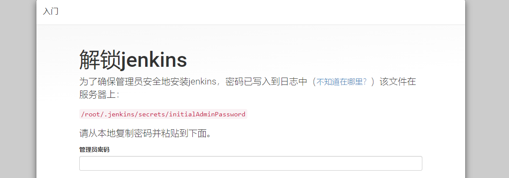
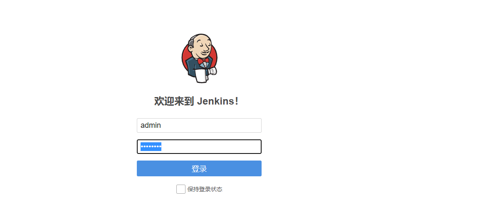

## Jenkins 安装和配置（CVM方式）

**1，安装jdk以及配置环境变量**

下载 JDK，输入如下命令：

```
mkdir /usr/java  # 创建 java 文件夹
cd    /usr/java     # 进入 java 文件夹
```

上传 JDK 安装包（推荐）

```
rz jdk-8u151-linux-x64.tar.gz
tar -xvf jdk-8u151-linux-x64.tar.gz    #解压
```

设置环境变量

```
vi /etc/profile
#添加如下环境变量=================
#############2020-10-10 jdk env################
export JAVA_HOME=/usr/java/jdk1.8.0_151
export CLASSPATH=$JAVA_HOME/lib/tools.jar:$JAVA_HOME/lib/dt.jar:$JAVA_HOME/lib
export PATH=$JAVA_HOME/bin:$PATH

```

加载环境变量

```
source /etc/profile
```

查看 JDK 是否安装成功

```
[root@VM-2-42-tlinux ~]# java -version
java version "1.8.0_151"
Java(TM) SE Runtime Environment (build 1.8.0_151-b12)
Java HotSpot(TM) 64-Bit Server VM (build 25.151-b12, mixed mode)
```

**2，安装maven以及配置环境变量**（可选）

```
mkdir /usr/maven       # 创建 maven 文件夹
cd     /usr/maven      # 进入 maven 文件夹
```

上传 maven安装包并解压

```
tar -xvf apache-maven-3.5.3-bin.tar.gz  -C  /usr/maven/
```

设置环境变量

```
vi /etc/profile

#############2021-10-10 maven env ##################
export MAVEN_HOME=/usr/maven/apache-maven-3.5.3
export PATH=$MAVEN_HOME/bin:$PATH
```

检查maven是否安装成功

```
[root@chen ~]# mvn -v
Apache Maven 3.5.3 (3383c37e1f9e9b3bc3df5050c29c8aff9f295297; 2018-02-25T03:49:05+08:00)
Maven home: /usr/maven/apache-maven-3.5.3
Java version: 1.8.0_151, vendor: Oracle Corporation
Java home: /usr/java/jdk1.8.0_151/jre
Default locale: en_US, platform encoding: UTF-8
OS name: "linux", version: "3.10.0-1127.13.1.el7.x86_64", arch: "amd64", family: "unix"
```

**3，安装tomcat**

上传或者下载安装包

```
[root@VM-2-42-tlinux ~]# cd /opt/tomcat/
[root@VM-2-42-tlinux /opt/tomcat]# ls
apache-tomcat-8.5.39.tar.gz

####
# 镜像地址会改变，Tomcat 版本也会不断升级。如果下载链接失效，请您到 [Tomcat 官网](https://tomcat.apache.org/download-80.cgi)选择合适的安装包地址。
wget http://mirrors.tuna.tsinghua.edu.cn/apache/tomcat/tomcat-8/v8.5.39/bin/apache-tomcat-8.5.39.tar.gz
tar -xzvf apache-tomcat-8.5.39.tar.gz
解压安装包
[root@VM-2-42-tlinux /opt/tomcat]# tar -xvf apache-tomcat-8.5.39.tar.gz
```

**4，下载Jenkins安装的war包**

Jenkins War Packages  https://get.jenkins.io/war-stable/

```
#
wget  http://mirrors.jenkins.io/war-stable/2.107.1/jenkins.war
mv   jenkins.war /opt/tomcat/apache-tomcat-8.5.39/webapps/ 
```

**5，启动tomcat服务**

进入 Tomcat 服务器的 bin 目录，然后执行`./startup.sh`命令启动 Tomcat 服务器。

```
cd /opt/tomcat/apache-tomcat-8.5.39/bin
./startup.sh
```

**6，登陆**

在浏览器地址栏中输入 `http://公网IP:端口`（端口为 server.xml 中设置的 connector port）进行访问，登陆服务控制台http://139.186.160.196:8080/jenkins

```
#密码获取
[root@VM-2-42-tlinux ~]# cat /root/.jenkins/secrets/initialAdminPassword
```



用户名：admin  密码：admin123

