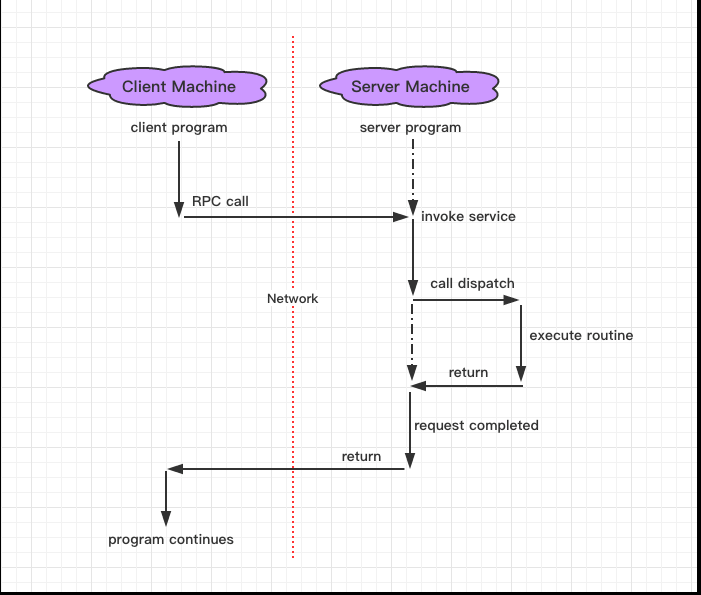
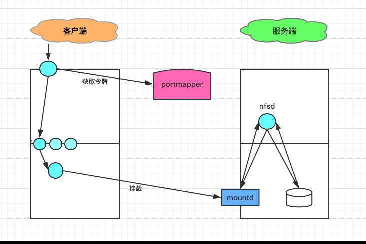
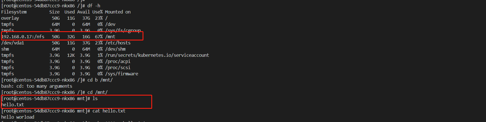
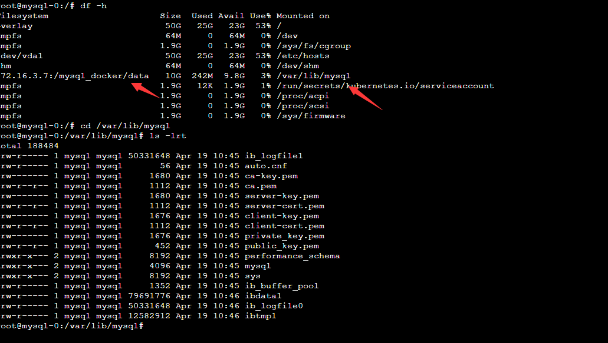

# Linux服务之NFS服务器

## 1. NFS 协议

> **`NFS`服务工作在`TCP`的`2049`端口，`UDP`的`2049`端口。**

`NFS`是`Network File System`的缩写，即**网络文件系统**，是一种使用于分散式文件系统的协定。功能是通过网络让不同的机器、不同的操作系统能够彼此分享个别的数据，让应用程序在客户端通过网络访问位于服务器磁盘中的数据，是在类`Unix`系统间实现磁盘文件共享的一种方法。

这个`NFS`服务器可以让你的`PC`来将网络远程的`NFS`服务器分享的目录，挂载到本地端的机器当中， 在本地端的机器看起来，那个远程主机的目录就好像是自己的一个磁盘分区槽一样。

------

### 1.1 工作原理

因为  `NFS` 支持的功能相当的多，而不同的功能都会使用不同的程序来启动， 每启动一个功能就会启用一些端口来传输数据，因此， `NFS` 的功能所对应的端口才没有固定住， 而是随机取用一些未被使用的小于  `1024` 的端口来作为传输之用。但如此一来又造成客户端想要连上服务器时的困扰， 因为客户端得要知道服务器端的相关端口才能够联机吧！

`NFS`在文件传送或信息传送过程中依赖于`RPC`协议。`RPC`，即**远程过程调用**的缩写，是能使客户端执行其他系统中程序的一种机制。`RPC` 最主要的功能就是在指定每个  `NFS` 功能所对应的端口号，并且回报给客户端，让客户端可以连结到正确的端口上去。

`NFS`本身是没有提供信息传输的协议和功能的，但`NFS`却能让我们通过网络进行资料的分享，这是因为`NFS`使用了一些其它的传输协议。而这些传输协议用到这个`RPC`功能的。可以说`NFS`本身就是使用`RPC`的一个程序，或者说`NFS`也是一个`RPC SERVER`。所以只要用到`NFS`的地方都要启动`RPC`服务，不论是`NFS SERVER`或者`NFS CLIENT`。这样`SERVER`和`CLIENT`才能通过`RPC`来实现`PROGRAM PORT`的对应。可以这么理解`RPC`和`NFS`的关系：**`NFS`是一个文件系统，而`RPC`是负责负责信息的传输**。

事实上，有很多这样的服务器都是向  `RPC` 注册的，举例来说，`NIS` (`Network Information Service`) 也是  `RPC server` 的一种。




**Linux服务之NFS服务器**


**那`RPC`又是如何知道每个`NFS`的端口呢？**

- 这是因为当服务器在启动  `NFS` 时会随机取用数个端口，并主动的向  `RPC` 注册，因此  `RPC` 可以知道每个埠口对应的  `NFS` 功能，然后  `RPC` 又是固定使用  `111` 端口来监听客户端的需求并报客户端正确的埠口， 所以当然可以让  `NFS` 的启动更为轻松愉快了。
- 所以你要注意，要启动  `NFS` 之前，`RPC` 就要先启动了，否则  `NFS` 会无法向  `RPC` 注册。 另外，`RPC` 若重新启动时，原本注册的数据会不见，因此  `RPC` 重新启动后，它管理的所有服务都要重新启动来重新向  `RPC` 注册。

**那客户端如何向`NFS`服务端交换数据数据呢？**

- (1) 客户端会向服务器端的  `RPC` 的`111`端口发出  `NFS` 档案存取功能的询问要求
- (2) 服务器端找到对应的已注册的  `NFS` 守护进程端口后，会回报给客户端
- (3) 客户端了解正确的端口后，就可以直接与  `NFS` 守护进程来联机

------

### 1.2 激活 NFS 服务

> **`NFS` 服务需要激活几个重要的  `RPC` 守护进程**

**工作流程**

- `nfs—client` => `portmapper` => `mountd` => `nfs-server(nfsd)`




**Linux服务之NFS服务器**


**(1) `rpc.nfsd`**

- 这个守护进程主要的功能，则是在管理客户端是否能够登入主机的权限，其中还包含这个登入者的  `ID` 的判别。

**(2) `rpc.mountd`**

- 主要功能
  - 这个守护进程主要的功能，则是在管理  `NFS` 的档案系统，用于给用户提供访问令牌。
  - 访问的令牌，由本地的`RPC`提供随机端口。本地的`RPC`叫做`portmapper`，可以使用`rpcinfo -P`查看。
  - `RPC`的`portmapper`服务工作在`1111`端口。
- 请求过程
  - 当客户端顺利的通过  `rpc.nfsd` 而登入主机之后，在它可以使用  `NFS server` 提供的档案之前，还会经过档案使用权限 的认证程序，就是那个`-rwxrwxrwx`、`owner`、`group`那几个权限啦。
  - 然后它会去读  `NFS` 的设定档  `/etc/exports` 来比对客户端的权限，当通过这一关之后，客户端就可以取得使用  `NFS` 档案的权限啦。

**注释：`NFS`需要有两个套件**

- `nfs-utils`
  - `NFS`服务的主要套件
  - 提供`rpc.nfsd`和`rpc.mountd`两个`NFS`守护进程和与其它相关文档与说明文件、执行档等的套件
- `portmap`
  - 主要负责`RPC`端口和守护进程的映射关系，即`portmapper`
  - 在激活任何一个`RPC server`之前，我们都需要激活`portmapper`才行

------

### 1.3 各个版本之间的比较

`NFS`是一种网络文件系统，从`1985`年推出至今，共发布了`3`个版本：`NFSv2`、`NFSv3`、`NFSv4`，`NFSv4`包含两个次版本`NFSv4.0`和`NFSv4.1`。经过`20`多年发展，`NFS`发生了非常大的变化，最大的变化就是推动者从`Sun`变成了`NetApp`，`NFSv2`和`NFSv3`基本上是`Sun`起草的，`NetApp`从`NFSv4.0`参与进来，并且主导了`NFSv4.1`标准的制定过程，而`Sun`已经被`Oracle`收购了。

| 编号 | 协议版本  | RFC     | 时间         | 页数   |
| :--- | :-------- | :------ | :----------- | :----- |
| 1    | `NFSv2`   | rfc1094 | 1989 年 3 月 | 27 页  |
| 2    | `NFSv3`   | rfc1813 | 1995 年 6 月 | 126 页 |
| 3    | `NFSv4.0` | rfc3530 | 2003 年 4 月 | 275 页 |
| 4    | `NFSv4.1` | rfc5661 | 2010 年 1 月 | 617 页 |

**1. NFSv2**

- `NFSv2`是第一个以`RFC`形式发布的版本，实现了基本的功能。

**2. NFSv3**

- 协议特点
  - `NFSv3`修正了`NFSv2`的一些`bug`，两者有如下一些差别，但是感觉没有本质的差别。
- 区别差别
  - (1) `NFSv2`只支持同步写，如果客户端向服务器端写入数据，服务器必须将数据写入磁盘中才能发送应答消息。`NFSv3`支持异步写操作，服务器只需要将数据写入缓存中就可以发送应答信息了。
  - (2) `NFSv3`增加了`ACCESS`请求，`ACCESS`用来检查用户的访问权限。因为服务器端可能进行`uid`映射，因此客户端的`uid`和`gid`不能正确反映用户的访问权限。
  - (3) 一些请求调整了参数和返回信息，毕竟`NFSv3`和`NFSv2`发布的间隔有`6`年，经过长期运行可能觉得`NFSv2`某些请求参数和返回信息需要改进。

**3. NFSv4.0**

- 协议特点
  - 相比`NFSv3`，`NFSv4`发生了比较大的变化，最大的变化是`NFSv4`有状态了。`NFSv2`和`NFSv3`都是无状态协议，服务区端不需要维护客户端的状态信息。
  - 无状态协议的一个优点在于灾难恢复，当服务器出现问题后，客户端只需要重复发送失败请求就可以了，直到收到服务器的响应信息。
- 区别差别
  - (1) `NFSv4`增加了安全性，支持`RPCSEC-GSS`身份认证。
  - (2) `NFSv4`设计成了一种有状态的协议，自身实现了文件锁功能和获取文件系统根节点功能。
  - (3) `NFSv4`只提供了两个请求`NULL`和`COMPOUND`，所有的操作都整合进了`COMPOUND`中，客户端可以根据实际请求将多个操作封装到一个`COMPOUND`请求中，增加了灵活性。
  - (4) `NFSv4`文件系统的命令空间发生了变化，服务器端必须设置一个根文件系统(`fsid=0`)，其他文件系统挂载在根文件系统上导出。
  - (5) `NFSv4`支持`delegation`。由于多个客户端可以挂载同一个文件系统，为了保持文件同步，`NFSv3`中客户端需要经常向服务器发起请求，请求文件属性信息，判断其他客户端是否修改了文件。如果文件系统是只读的，或者客户端对文件的修改不频繁，频繁向服务器请求文件属性信息会降低系统性能。`NFSv4`可以依靠`delegation`实现文件同步。
  - (6) `NFSv4`修改了文件属性的表示方法。由于`NFS`是`Sun`开发的一套文件系统，设计之出`NFS`文件属性参考了`UNIX`中的文件属性，可能`Windows`中不具备某些属性，因此`NFS`对操作系统的兼容性不太好。

**4. NFSv4.1**

- 与`NFSv4.0`相比，`NFSv4.1`最大的变化是支持并行存储了。在以前的协议中，客户端直接与服务器连接，客户端直接将数据传输到服务器中。
- 当客户端数量较少时这种方式没有问题，但是如果大量的客户端要访问数据时，`NFS`服务器很快就会成为一个瓶颈，抑制了系统的性能。`NFSv4.1`支持并行存储，服务器由一台元数据服务器(`MDS`)和多台数据服务器(`DS`)构成，元数据服务器只管理文件在磁盘中的布局，数据传输在客户端和数据服务器之间直接进行。由于系统中包含多台数据服务器，因此数据可以以并行方式访问，系统吞吐量迅速提升。

------

## 2. NFS 服务搭建

> `CentOS7`以`NFSv4`作为默认版本，`NFSv4`使用`TCP`协议（端口号是`2049`）和`NFS`服务器建立连接。

```bash
# 系统环境
系统平台：CentOS Linux release 7.9 (Final)
NFS Server IP：192.168.0.17
防火墙已关闭/iptables: Firewall is not running.
SELINUX=disabled
```

### 2.1 安装 NFS 服务

- 服务端
  - 服务端，程序包名`nfs-utils`、`rpcbind`，默认都已经安装了
  - 可以通过`rpm -ql nfs-utils`查看帮助文档等信息
- 客户端
  - 客户端，需要安装程序包名`nfs-utils`，提供基本的客户端命令工具

```
[root@VM-0-17-tlinux ~/nfs]# yum install nfs-utils -y

```

- 查看`NFS`服务端口
  - `NFS`启动时会随机启动多个端口并向`RPC`注册，为了方便配置防火墙，需要固定`NFS`服务端口。
  - 这样如果使用`iptables`对`NFS`端口进行限制就会有点麻烦，可以更改配置文件固定`NFS`服务相关端口
  - 分配端口，编辑配置文件`/etc/sysconfig/nfs`

```
# 使用rpcinfo -P会发现rpc启动了很多监听端口
[root@VM-0-17-tlinux ~/nfs]# rpcinfo -p localhost:q1
# 添加如下
[root@VM-0-17-tlinux ~/nfs]#  vim /etc/sysconfig/nfs
RQUOTAD_PORT=30001
LOCKD_TCPPORT=30002
LOCKD_UDPPORT=30002
MOUNTD_PORT=30003
STATD_PORT=30004
```

启动服务：

```
[root@VM-0-17-tlinux ~/nfs]# systemctl start nfs.service
```

### 2.2 服务文件配置

- **相关文件和命令**

| 文件名                | 说明                                                         |
| :-------------------- | :----------------------------------------------------------- |
| **`/etc/exports`**    | NFS 服务器端需要设定的内容，其作用是设定谁拥有什么样的权限去访问此机器的哪个目录 |
| `/var/lib/nfs/etab`   | 无需设定，用于纪录 NFS 服务器完整的权限设定，exports 中没有设定的缺省值也会被列出 |
| `/var/lib/nfs/xtab`   | 纪录 NFS 连接的相关信息                                      |
| `/usr/sbin/exportfs`  | NFS 设定管理命令，用于 Server 侧设定，通过此条命令使得 exports 的设定变得有效或者无效 |
| `/usr/sbin/showmount` | 用于显示 NFS 设定的相关信息，Server 端和 Client 端均可       |

**配置文件`/etc/exports`**

- 我们可以按照**“共享目录的路径 允许访问的 NFS 客户端(共享权限参数)”**的格式，定义要共享的目录与相应的权限

| 常用参数              | 作用                                                         |
| :-------------------- | :----------------------------------------------------------- |
| `ro`                  | 只读                                                         |
| `rw`                  | 读写                                                         |
| `sync`                | 同时将数据写入到内存与硬盘中，保证不丢失数据                 |
| `async`               | 优先将数据保存到内存，然后再写入硬盘；这样效率更高，但可能会丢失数据 |
| `root_squash`         | 当 NFS 客户端以 root 管理员访问时，映射为 NFS 服务器的匿名用户 |
| `all_squash`          | 无论 NFS 客户端使用什么账户访问，均映射为 NFS 服务器的匿名用户 |
| `no_root_squash`      | 当 NFS 客户端以 root 管理员访问时，映射为 NFS 服务器的 root 管理员 |
| `secure`              | 这个选项是缺省选项，它使用了 1024 以下的 TCP/IP 端口实现 NFS 的连接 |
| `insecure`            | 禁止使用了 1024 以下的 TCP/IP 端口实现 NFS 的连接            |
| `no_wdelay`           | 这个选项关闭写延时，如果设置了 async，那么 NFS 就会忽略这个选项 |
| `nohide`              | 如果将一个目录挂载到另外一个目录之上，那么原来的目录通常就被隐藏起来或看起来像空的一样。要禁用这种行为，需启用 hide 选项 |
| `no_subtree_check`    | 这个选项关闭子树检查，子树检查会执行一些不想忽略的安全性检查，缺省选项是启用子树检查 |
| `no_auth_nlm`         | 这个选项也可以作为`insecure_locks`指定，它告诉 NFS 守护进程不要对加锁请求进行认证。如果关心安全性问题，就要避免使用这个选项。缺省选项是`auth_nlm`或`secure_locks`。 |
| `mp(mountpoint=path)` | 通过显式地声明这个选项，NFS 要求挂载所导出的目录             |
| `fsid=num`            | 这个选项通常都在 NFS 故障恢复的情况中使用，如果希望实现 NFS 的故障恢复，请参考 NFS 文 |

```bash
[root@VM-0-17-tlinux ~/nfs]# cat /etc/exports
/nfs 192.168.*.*(rw,sync,root_squash)

#修改完配置后 重新启动nfs服务
root@VM-0-17-tlinux ~/nfs]# systemctl   restart nfs
[root@VM-0-17-tlinux ~/nfs]# systemctl   status  nfs
```

------

## 3. 实战演示

> 将NFS挂在到K8S容器服务的POD里面

### 案例一

```
apiVersion: apps/v1
kind: Deployment
metadata:
  labels:
    k8s-app: centos
  name: centos
  namespace: default
spec:
  replicas: 1
  selector:
    matchLabels:
      k8s-app: centos
  template:
    metadata:
      labels:
        k8s-app: centos
    spec:
      containers:
      - args:
        - -c
        - sleep 360000
        command:
        - /bin/sh
        image: centos:latest
        imagePullPolicy: IfNotPresent
        name: centos
        resources: {}
        volumeMounts:
        - mountPath: /mnt
          name: nfs
      volumes:
      - name: nfs
        nfs:
          path: /nfs
          server: 192.168.0.17

```




```
[root@VM-0-17-tlinux ~/nfs]# cd /nfs/
[root@VM-0-17-tlinux /nfs]# echo  hello worload > hello.txt
[root@VM-0-17-tlinux /nfs]# cat hello.txt 
hello worload

#登录容器查看挂着情况
[root@VM-0-17-tlinux /nfs]# kubectl  exec -it centos-54db87ccc9-nkx86 -- /bin/bash
[root@centos-54db87ccc9-nkx86 /]# 
[root@centos-54db87ccc9-nkx86 /]# df -h
Filesystem         Size  Used Avail Use% Mounted on
overlay             50G   11G   37G  23% /
tmpfs               64M     0   64M   0% /dev
tmpfs              3.9G     0  3.9G   0% /sys/fs/cgroup
192.168.0.17:/nfs   50G   32G   16G  67% /mnt
/dev/vda1           50G   11G   37G  23% /etc/hosts
shm                 64M     0   64M   0% /dev/shm
tmpfs              3.9G   12K  3.9G   1% /run/secrets/kubernetes.io/serviceaccount
tmpfs              3.9G     0  3.9G   0% /proc/acpi
tmpfs              3.9G     0  3.9G   0% /proc/scsi
tmpfs              3.9G     0  3.9G   0% /sys/firmware
[root@centos-54db87ccc9-nkx86 /]# cd /mnt/
[root@centos-54db87ccc9-nkx86 mnt]# cat hello.txt 
hello worload
[root@centos-54db87ccc9-nkx86 mnt]# echo 1111>> hello.txt 
bash: hello.txt: Permission denied
[root@centos-54db87ccc9-nkx86 mnt]ls -lrt
total 4
-rw-r--r-- 1 root root 14 Oct 17 13:14 hello.txt
```

可以看到 上面我们的 

```
/etc/exports
/nfs 192.168.*.*(rw,sync,root_squash)
#是没有权限修改文件
```

下面我们将配置文件修改成如下配置进行测试

```
[root@VM-0-17-tlinux /nfs]# cat /etc/exports
/nfs 192.168.*.*(rw,sync,no_root_squash)

#重启NFS 服务
[root@VM-0-17-tlinux /nfs]# systemctl  restart nfs
[root@VM-0-17-tlinux /nfs]# systemctl status nfs
```

将POD销毁重建后登录POD里测试。可以修改文件 并且可以创建文件

```
[root@centos-54db87ccc9-rgnk8 mnt]# touch 222
[root@centos-54db87ccc9-rgnk8 mnt]# ls
222  hello.txt
[root@centos-54db87ccc9-rgnk8 mnt]# echo "1111">> hello.txt 
[root@centos-54db87ccc9-rgnk8 mnt]# cat hello.txt 
hello worloada
1111
[root@centos-54db87ccc9-rgnk8 mnt]# ls -lrt
total 4
-rw-r--r-- 1 root root  0 Oct 17 13:24 222
-rw-r--r-- 1 root root 20 Oct 17 13:28 hello.txt
```

### 案例二

使用PVC和PV方式创建并挂载

```
---
apiVersion: v1
kind: PersistentVolume
metadata:
  name: pv-operationdata
spec:
  accessModes:
     - ReadWriteMany
  capacity:
     storage: 10Gi
  csi:
    driver: com.tencent.cloud.csi.cfs
    volumeAttributes:
       host: 192.168.0.17
       path: /nfs
    volumeHandle: cfs-pv2
  persistentVolumeReclaimPolicy: Retain
  volumeMode: Filesystem

---
apiVersion: v1
kind: PersistentVolumeClaim
metadata:
  name: pvc-operationdata
  namespace: default
spec:
  accessModes:
  - ReadWriteMany
  resources:
    requests:
      storage: 10Gi
  storageClassName: ""
  volumeMode: Filesystem
  volumeName: pv-operationdata


---
apiVersion: apps/v1
kind: Deployment
metadata:
  labels:
    k8s-app: centos
  name: centos
  namespace: default
spec:
  replicas: 1
  selector:
    matchLabels:
      k8s-app: centos
  template:
    metadata:
      labels:
        k8s-app: centos
    spec:
      containers:
      - args:
        - -c
        - sleep 360000
        command:
        - /bin/sh
        image: centos:latest
        imagePullPolicy: IfNotPresent
        name: centos
        resources: {}
        volumeMounts:
        - mountPath: /mnt
          name: nfs
      volumes:
      - name: nfs
        persistentVolumeClaim:
          claimName: pvc-operationdata

```


### 案例三  服务器端挂载

- 使用`showmount`命令查询`NFS`服务器的远程共享信息
- `showmount`命令输出格式为**“共享的目录名称 允许使用客户端地址”**

------

**`showmount`命令**

| 参数 | 作用                                        |
| :--- | :------------------------------------------ |
| `-e` | 显示 NFS 服务器的共享列表                   |
| `-a` | 显示本机挂载的文件资源的情况 NFS 资源的情况 |
| `-v` | 显示版本号                                  |

**`exportfs`命令**

- 维护`exports`文件导出的文件系统表的专用工具，可以修改配置之后不重启`NFS`服务
- `export -ar`：重新导出所有的文件系统
- `export -au`：关闭导出的所有文件系统
- `export -u FS`:：关闭指定的导出的文件系统


```bash
# 查看NFS服务器端共享的文件系统
# showmount -e NFSSERVER_IP
[root@VM-0-17-tlinux ~/nfs]#  showmount -e 192.168.0.17
Export list for 192.168.0.17:
/nfs 192.168.*.*

# NFS客户端创建一个挂载目录，挂载服务端NFS文件系统到本地
# mount -t nfs SERVER:/path/to/sharedfs  /path/to/mount_point
[root@VM-0-11-tlinux ~]# mkdir /nfsfile
[root@VM-0-11-tlinux ~]# mount -t nfs 192.168.0.17:/nfs /nfsfile
[root@VM-0-11-tlinux ~]# df -h | grep nfsfile
192.168.0.17:/nfs    50G   32G   16G  67% /nfsfile
```


```bash
# 挂载成功后就应该能够顺利地看到在执行前面的操作时写入的文件内容了
[root@VM-0-11-tlinux ~]# cat /nfsfile/hello.txt 
hello worloada
1111

# 如果希望NFS文件共享服务能一直有效，则需要将其写入到fstab文件中
# SERVER:/PATH/TO/EXPORTED_FS  /mount_point  nfs  defaults,_netdev  0  0
[root@VM-0-11-tlinux ~]#  vim /etc/fstab
192.168.0.17:/nfs  /nfsfile nfs defaults 0 0
```


参考文档：https://www.escapelife.site/posts/c49dfbab.html

 

```
apiVersion: apps/v1
kind: StatefulSet
metadata:
  labels:
    k8s-app: mysql
    qcloud-app: mysql
  name: mysql
spec:
  podManagementPolicy: OrderedReady
  replicas: 1
  revisionHistoryLimit: 10
  selector:
    matchLabels:
      k8s-app: mysql
      qcloud-app: mysql
  serviceName: ""
  template:
    metadata:
      labels:
        k8s-app: mysql
        qcloud-app: mysql
    spec:
      containers:
      - env:
        - name: MYSQL_ROOT_PASSWORD
          value: "123456"
        image: mysql:5.7
        imagePullPolicy: IfNotPresent
        name: mysql
        volumeMounts:
        - mountPath: /var/lib/mysql
          name: nfs
          subPath: mysql_docker/data
      dnsPolicy: ClusterFirst
      imagePullSecrets:
      - name: qcloudregistrykey
      restartPolicy: Always
      volumes:
      - name: nfs
        nfs:
          path: /
          server: 172.16.3.7


```

