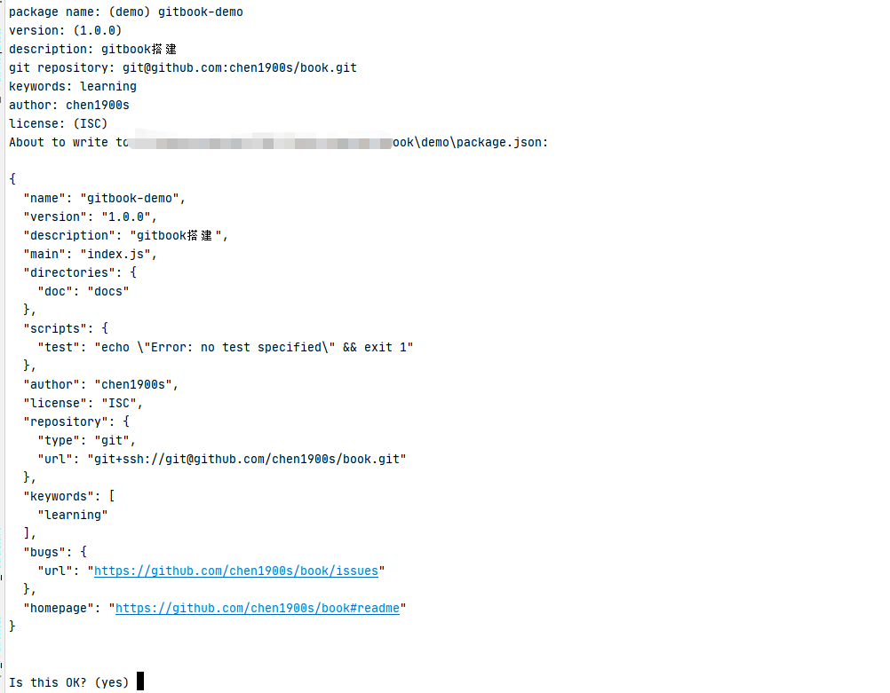
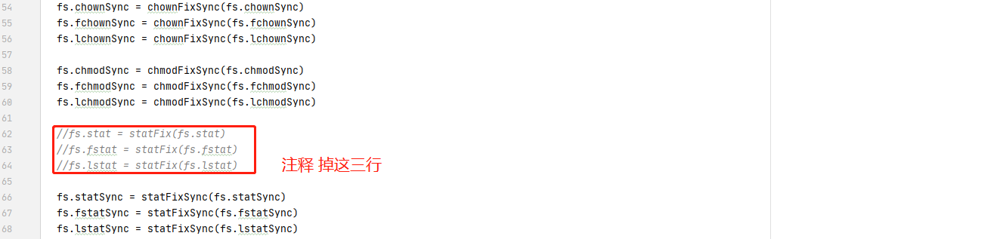

##  <center>环境准备

### 1，配置 Node.js 环境

使用 Gitbook 需要配置 Node.js 环境，具体的安装步骤，可查看[官方文档](https://nodejs.org/zh-cn/download/)。

>  由于目前 Gitbook 项目已经停止维护，Node 过高可能出现不兼容问题，文档后面有常见报错处理方案

 安装成功后，执行命令可查看 node 版本和 npm 版本。 

```shell
# 查看npm版本
npm -v
9.6.5

# 查看node版本
node -v
v18.14.2
```

### 2，安装 Gitbook

使用下面命令，安装 gitbook 包

```shell
npm install -g gitbook-cli
```

### 3，初始化项目

#### 3.1，Gitbook 初始化

创建一个文件夹，并进入到该文件夹中，执行下面命令，初始化 gitbook 项目。

```sh
gitbook init
```

执行结果

```sh
info: create SUMMARY.md
info: initialization is finished
```

可以看到创建了 SUMMARY.md 文档，这是电子书的目录文档。

然后创建一个 REAMDE.md 文档，用来对这个项目进行介绍。

#### 3.2，npm 初始化

执行下面命令，初始化为 npm 项目。

```sh
npm init
```

命令会提示输入项目信息，可默认不填写，直接回车。

最后，会显示配置信息，输入`yes`回车即可初始化完毕。



初始化成功后，系统会自动在当前目录创建`package.json`文件，这是 npm 项目的配置文件。

#### 3.3，章节配置

GitBook 使用文件 `SUMMARY.md` 来定义书本的章节和子章节的结构。文件 `SUMMARY.md` 被用来生成书本内容的预览表。

`SUMMARY.md` 的格式是一个简单的链接列表，链接的名字是章节的名字，链接的指向是章节文件的路径。

子章节被简单的定义为一个内嵌于父章节的列表。

```markdown
# 概要

- [章节一](chapter1.md)
- [章节二](chapter2.md)
- [章节三](chapter3.md)

# 概要
- [第一章](part1/README.md)
  - [1.1 第一节](part1/writing.md)
  - [1.2 第二节](part1/gitbook.md)
- [第二章](part2/README.md)
  - [2.1 第一节](part2/feedback_please.md)
  - [2.2 第二节](part2/better_tools.md)
```

### 4，启动项目

在`package.json`文件的`scripts`中配置如下的脚本命令：

```json
"scripts": {
    "serve": "gitbook serve",
    "build": "gitbook build"
}
```

分别是 gitbook 在本地启动的命令，和 gitbook 打包成 HTML 静态文件的命令。

对于本地演示，我们可以直接通过下面命令启动。

```sh
npm run serve
```

这条命令其实就是执行了`package.json`文件的`scripts`中的`serve`脚本，即`gitbook serve`。

启动成功后，就可以在浏览器输入`http://localhost:4000/`，如图所示。

### 5，忽略文件

任何在文件夹下的文件，在最后生成电子书时都会被拷贝到输出目录中，如果想要忽略某些文件，和 Git 一样， Gitbook 会依次读取 `.gitignore`, `.bookignore` 和 `.ignore` 文件来将一些文件和目录排除。

### 6，配置文件

Gitbook 在编译书籍的时候会读取书籍源码顶层目录中的 `book.js` 或者 `book.json`，这里以 `book.json` 为例，参考 [gitbook 文档](https://github.com/GitbookIO/gitbook) 可以知道，`book.json` 常用的配置如下。

```json
{
    // 书籍信息
    "title": "学习杂技",
    "description": "笔记",
    "isbn": "图书编号",
    "author": "chen1900s",
    "lang": "zh-cn",

    // 插件列表
    "plugins": [],

    // 插件全局配置
    "pluginsConfig": {
        "fontSettings": {
            "theme": "sepia", "night" or "white",
            "family": "serif" or "sans",
            "size": 1 to 4
        }
    },

      // 模板变量
      "variables": {
          // 自定义
    }
}
```


## <center>gitbook插件使用

Gitbook 最灵活的地方就是有很多插件可以使用，当然如果对插件不满意，也可以自己写插件。所有插件的命名都是以`gitbook-plugin-xxx`的形式。下面，我们就介绍一些常用的插件。

使用插件前，现在当前项目的根目录中创建一个`book.js`文件，这是 Gitbook 的配置文件，文件内容可以根据自己来定制，内容格式如上。

### 1，搜索插件

在命令行输入下面命令安装[搜索插件](https://www.npmjs.com/package/gitbook-plugin-search-pro)。

```sh
npm install gitbook-plugin-search-pro
```

安装成功后，在`book.js`中添加插件的配置。

```js
{
  plugins: ['search-pro'];
}
```

### 2，代码框插件

在命令行输入下面命令安装[代码插件](https://www.npmjs.com/package/gitbook-plugin-code)。

```sh
npm install gitbook-plugin-code
```

安装成功后，在`book.js`中添加插件的配置。

```js
{
  plugins: ['code'];
}
```

### 3，自定义主题插件

在命令行输入下面命令安装[自定义主题插件](https://www.npmjs.com/package/gitbook-plugin-theme-default)。

```sh
npm install gitbook-plugin-theme-主题名
```

安装成功后，在`book.js`中添加插件的配置。

```sh
{
    plugins: ["theme-主题名"]
}
```

### 4，菜单折叠插件

在命令行输入下面命令安装[菜单栏折叠插件](https://www.npmjs.com/package/gitbook-plugin-expandable-chapters)。

```sh
npm install gitbook-plugin-expandable-chapters
```

安装成功后，在`book.js`中添加插件的配置。

```js
{
  plugins: ['expandable-chapters'];
}
```

### 5，返回顶部插件

在命令行输入下面命令安装[返回顶部插件](https://www.npmjs.com/package/gitbook-plugin-back-to-top-button)。

```sh
npm install gitbook-plugin-back-to-top-button
```

安装成功后，在`book.js`中添加插件的配置。

```js
{
  plugins: ['back-to-top-button'];
}
```

### 6，最终效果

下面我们来看看我的运行效果图，比刚开始美观多了。


> 更多插件可以从 https://plugins.gitbook.com/ 获取。


## <center>遇到的问题

### 1，TypeError [ERR_INVALID_ARG_TYPE]报错

gitbook init 报 TypeError [ERR_INVALID_ARG_TYPE]: The "data" argument must be of type string or an instance of Buffer, TypedArray, or DataView. Received an instance of Promise

> GitBook version: 3.2.3
>
> npm 9.6.5
>
> nodejs v18.14.2


**解决方案**

将 C:\Users\用户\\.gitbook\versions\3.2.3\lib\ init.js  中第71行附近的

```js
return fs.writeFile(filePath, summary.toText(extension));
```

修改为

```js
return summary.toText(extension).then(stx=>{return fs.writeFile(filePath, stx);})
```

### 2，cb.apply is not a function报错

2，高版本Node版本运行gitbook init报错  cb.apply is not a function

```
C:\Users\ac_chenjw\AppData\Roaming\npm\node_modules\gitbook-cli\node_modules\npm\node_modules\graceful-fs\polyfills.js:287
      if (cb) cb.apply(this, arguments)
```

原因是 npm版本的问题 导致

**解决方案**

查看报错的源码,在node_module/graceful-fs/polyfills.js的285行，对应函数是在 61-63行 ，注释掉就可以

文件路径

```sh
 C:\Users\用户\AppData\Roaming\npm\node_modules\gitbook-cli\node_modules\npm\node_modules\graceful-fs\polyfills.js:287
```



```
  fs.stat = statFix(fs.stat)
  fs.fstat = statFix(fs.fstat)
  fs.lstat = statFix(fs.lstat)
```

